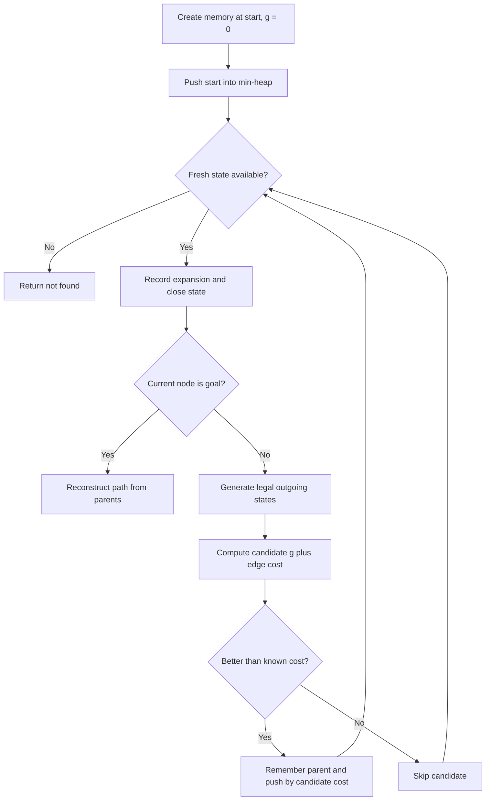
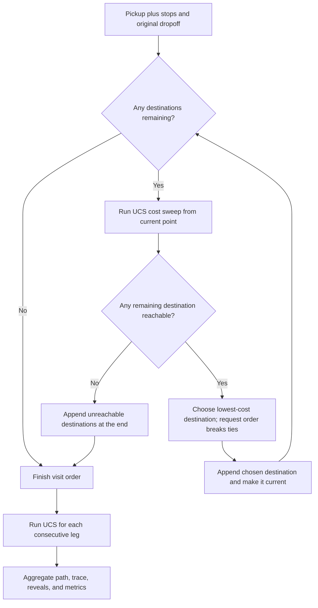
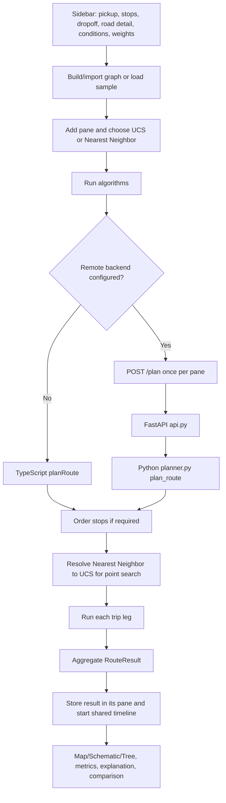

# UCS and Nearest Neighbor in Route Lab

## 1. What these algorithms are

Route Lab represents a delivery network as a directed graph:

- A node is a road intersection.
- An edge is a road segment that can be one-way.
- A trip can contain a pickup, intermediate stops, and a dropoff.
- A multi-stop trip is split into point-to-point legs: pickup to stop, stop to stop, and final stop to dropoff.
- Vehicle restrictions, time period, and turn restrictions decide which edges may be used.

The cost minimized by the algorithms is:

```text
edge cost =
    distance weight   * distance in km
  + time weight       * travel time in minutes
  + congestion weight * congestion * distance in km
  + risk weight       * risk * vehicle risk factor * distance in km
```

The implementation is in `server/src/route_lab/shared/traffic.py` and its browser equivalent is in `web/src/lib/traffic.ts`.

### Uniform Cost Search (UCS)

UCS is a point-to-point graph search. It always expands the open state with the smallest accumulated cost `g(n)`. In this project, UCS is equivalent to Dijkstra's algorithm.

Because accepted edge costs are non-negative, UCS returns a minimum-cost path for the selected weights and conditions. It does not use a heuristic, so it may explore more of the graph than A*.

Use UCS when:

- The cheapest route under the current weighted cost is required.
- There is one destination or the stop order has already been decided.
- A correctness guarantee is more important than reducing the number of expanded nodes.

Primary implementations:

- Python: `server/src/route_lab/algorithms/ucs.py` → `uniform_cost_search()`
- TypeScript: `web/src/lib/search.ts` → `uniformCostSearch()`

### Nearest Neighbor

Nearest Neighbor is not a separate point-to-point search in Route Lab. It is a greedy strategy for ordering multiple destinations.

From the current location, it runs a UCS cost sweep to all remaining destinations, selects the reachable destination with the lowest exact route cost, moves it into the visit order, and repeats. Destinations include the intermediate stops and original dropoff. Once the order is chosen, normal UCS builds every point-to-point leg and produces the path and visualization trace.

Each individual leg is cheapest for its two endpoints, but the complete multi-stop trip is not guaranteed to be globally cheapest because each next-stop choice is only locally best.

Use Nearest Neighbor when:

- There are multiple intermediate stops whose visit order may change.
- A quick, traffic-aware greedy order is acceptable.
- Global multi-stop optimality is not required.

Primary implementations:

- Python ordering: `server/src/route_lab/algorithms/nearest_neighbor.py` → `nearest_neighbor_order()`
- TypeScript ordering: `web/src/lib/search.ts` → `nearestNeighborOrder()`
- Both planners then select UCS for each leg.

## 2. UCS step by step

For each trip leg, UCS performs these steps:

1. Create search memory for the start node. Store cost `0`, no parent, and no incoming edge.
2. Push the start state into a binary min-heap with priority `0`.
3. Pop the fresh heap entry with the lowest accumulated cost. Old heap entries are ignored when a better cost has already replaced them.
4. Mark that state closed and record an expansion in the trace used by the UI.
5. If its node is the goal, stop. Following the stored parent links reconstructs the chosen nodes and exact road edges.
6. Otherwise, inspect every legal outgoing edge:
   - Reject roads unavailable to the selected vehicle or time period.
   - Reject turns forbidden by an active turn restriction.
   - Ignore successor states that are already closed.
7. Calculate `candidate cost = current g + edge cost`.
8. If the successor already has an equal or lower known cost, ignore this candidate.
9. If the candidate is better, store its cost, parent, incoming edge, and node, then push it into the heap using the candidate cost as its priority.
10. Repeat from step 3 until the goal is settled or the heap becomes empty.
11. If the heap becomes empty, return `found = false` with an empty path. The planner creates a useful blocked-route explanation.

When turn restrictions exist, a search state includes both the intersection and the incoming road/way. This prevents a cheap arrival from incorrectly hiding a more expensive arrival that permits the next legal turn.

### UCS flow



## 3. Nearest Neighbor step by step

The ordering stage works as follows:

1. Copy every requested destination—intermediate stops plus the original dropoff—into `remaining`; set `current` to the pickup.
2. Run one UCS sweep from `current` to obtain exact costs for all reachable destinations in `remaining`.
3. Choose the remaining destination with the lowest cost.
4. If two destinations have the same cost, keep their original request order.
5. Remove the chosen destination from `remaining`, append it to the visit order, and make it the new `current`.
6. Repeat until no destinations remain.
7. If none of the remaining destinations is reachable, keep them at the end instead of dropping them. The normal leg planner will then expose and explain the blocked leg.
8. Build the full sequence from the pickup and ordered destinations. Consecutive duplicate nodes are removed. Because the original dropoff is a candidate, Nearest Neighbor may visit it before another stop.
9. Run UCS separately for every consecutive pair in that sequence.
10. Join the leg paths, traces, reveal points, timings, and metrics into one `RouteResult`.

The UCS sweeps used only to choose the stop order are not displayed. The displayed trace comes from the UCS runs that construct the final legs.

### Nearest Neighbor flow



## 4. When Route Lab applies destination ordering

The **Optimize visit order** checkbox controls destination ordering for normal point-search algorithms. Nearest Neighbor is the exception and always optimizes the order:

| Pane selection | Ordering | Point-to-point algorithm |
|---|---|---|
| UCS, BFS, DFS, or A*; checkbox off | Entered stops, then original dropoff | The selected algorithm |
| UCS, BFS, DFS, or A*; checkbox on | Nearest Neighbor over stops plus original dropoff | The selected algorithm |
| Nearest Neighbor; checkbox on or off | Nearest Neighbor over stops plus original dropoff | UCS |
| Held-Karp; checkbox off | Entered closed-tour order | A* |
| Held-Karp; checkbox on | Its own exact closed-tour optimization | Pairwise A* |

Important details:

- With the checkbox off, UCS and the other point-search algorithms preserve the entered sequence.
- With the checkbox on, those algorithms share the same Nearest Neighbor destination order, but each still runs its own search for every leg.
- Selecting Nearest Neighbor always enables destination ordering, even when the checkbox is off.
- The original dropoff participates in Nearest Neighbor ordering and is not forced to be the final visit.
- A Nearest Neighbor result is marked approximate even when it happens to produce the same path as UCS. The project never claims that its full trip order is globally optimal.
- UCS is marked optimal only for a found route with no intermediate stops and at least one non-zero cost weight.

## 5. End-to-end control flow



Detailed code path:

1. `web/src/components/Sidebar.tsx` controls the trip, network, conditions, weights, stop-order checkbox, and **Run algorithms** button.
2. `web/src/components/MapPane.tsx` renders the algorithm `<select>`. Its choices come from `ALGOS` in `web/src/lib/search.ts`.
3. Selecting an algorithm calls `setPaneAlgo()` in `web/src/store.ts`. Adding a pane uses this default order: A*, UCS, BFS, DFS, Nearest Neighbor, Held–Karp. Greedy Best-First has been removed from both web and server.
4. Pressing **Run algorithms** calls `run()` in `web/src/store.ts`.
5. `run()` creates one planning job per pane and chooses the execution path:
   - Local path: call `planRoute()` in `web/src/lib/search.ts`.
   - Remote path: `planRouteRemote()` in `web/src/lib/planClient.ts` sends `POST /plan`; `server/src/route_lab/api.py` validates the request and calls `plan_route()` in `server/src/route_lab/planner.py`.
   - When the backend is configured, it receives every graph, including the browser-built sample graph.
6. The local and remote planners apply the same ordering rule, build the leg sequence, resolve a Nearest Neighbor selection to UCS, and run every leg.
7. The Python planner dispatches normal point searches through `POINT_SEARCHES` in `server/src/route_lab/algorithms/registry.py`. `nearest` is intentionally absent from this registry because it is an ordering layer, not a point search.
8. Each pane receives a `RouteResult` containing `path`, `order`, `trace`, `reveal`, `found`, an optional `problem`, node IDs, and metrics.
9. The store calculates the longest pane trace as `maxStep`, resets the shared step to `0`, and starts playback.

## 6. What controls and displays the algorithms

| Responsibility | File | Main behavior |
|---|---|---|
| Algorithm list and labels | `web/src/lib/search.ts` | `ALGOS` supplies keys, names, colors, optimality metadata, and notes. |
| Algorithm selection | `web/src/components/MapPane.tsx` | The pane selector calls `setPaneAlgo()`; Map/Schematic/Tree tabs select a view. |
| Run and state control | `web/src/store.ts` | Owns panes, selected algorithms, results, shared timeline state, and automatic replay. |
| Trip and cost controls | `web/src/components/Sidebar.tsx` | Pickup, stops, dropoff, network, period, vehicle, criterion, weights, ordering checkbox, and run button. |
| Browser planner | `web/src/lib/search.ts` | Implements the selectable browser algorithms, Nearest Neighbor ordering, leg dispatch, aggregation, trace, and result creation. |
| Backend client | `web/src/lib/planClient.ts` | Sends the selected pane algorithm and planning input to `POST /plan`. |
| Backend entry point | `server/src/route_lab/api.py` | Exposes `POST /plan` and forwards validated requests to the planner. |
| Backend trip controller | `server/src/route_lab/planner.py` | Orders stops, resolves `nearest` to UCS, runs legs, combines results, and decides the optimal flag. |
| Backend algorithm dispatch | `server/src/route_lab/algorithms/registry.py` | Maps point-search keys such as `ucs` to their functions. |
| UCS implementation | `server/src/route_lab/algorithms/ucs.py` | Runs the lowest-accumulated-cost expansion loop. |
| Nearest Neighbor implementation | `server/src/route_lab/algorithms/nearest_neighbor.py` | Repeatedly computes UCS costs and chooses the next stop. |
| Shared search bookkeeping | `server/src/route_lab/shared/search.py` | Handles legal successor generation, parents, exact edges, traces, metrics, turn-aware state, and path reconstruction. |
| Pane visualization | `web/src/components/MapPane.tsx` | Uses the current trace step to show expanded/current/frontier nodes and uses `reveal` to draw completed route legs. |
| Tree visualization | `web/src/components/TreeView.tsx` | Draws parent relationships from the trace as a search tree. |
| Playback control | `web/src/components/Timeline.tsx` | One shared Back/Play/Forward/slider timeline drives all panes at the same step. |
| Route explanation | `web/src/components/Explain.tsx` and `web/src/lib/explain.ts` | Explains route quality, visit order, congestion, alternatives, failures, and optimality. |
| Vehicle comparison | `web/src/components/Compare.tsx` | Re-runs the first pane's selected algorithm for each vehicle when the comparison is opened. |
| Page composition | `web/src/App.tsx` | Places the sidebar, panes, explanation, comparison, and timeline on screen. |

### How one trace step is displayed

For the shared timeline step selected by the user:

1. `Timeline.tsx` updates the global `step` in the Zustand store.
2. Every `MapPane` reads the same step but clamps it to its own trace length.
3. The pane uses `trace[step - 1]` to identify the current expanded node and frontier nodes.
4. Previously expanded nodes remain visible with fading styles.
5. When the step reaches a leg's `reveal.upto` value, that completed leg is added to the drawn route.
6. While playback is incomplete, the footer shows search progress. At completion it shows distance, time, weighted cost, expanded nodes, runtime, turn restrictions, and the optimal/approximate verdict.
7. The Tree view reads the same result and step, so switching views does not rerun the algorithm.

## 7. Practical selection guide

| Situation | Recommended choice | Reason |
|---|---|---|
| One pickup and one dropoff; minimum weighted cost required | UCS | It guarantees the minimum-cost route for the non-negative edge costs used here. |
| Several stops already listed in the required order | UCS with **Optimize visit order** off | UCS optimizes each fixed leg without changing the requested order. |
| Several stops may be reordered and a fast practical order is enough | Nearest Neighbor | It greedily selects the cheapest reachable next stop using exact UCS route costs. |
| Compare Nearest Neighbor against another search algorithm | Add both panes and run them | Nearest Neighbor always changes the order; the other pane follows the checkbox. |
| A globally optimal multi-stop tour is required | Neither current option provides this guarantee | Nearest Neighbor is greedy, and UCS only optimizes each fixed point-to-point leg. |

## 8. Verification already present in the project

The backend tests confirm the documented behavior:

- `server/tests/test_ucs.py` checks the known cheapest path, full search metrics, unreachable behavior, and optimality flags.
- `server/tests/test_ordering.py` checks cheapest-stop-first ordering, request-order tie breaking, selection of the current location at zero cost, and retention of unreachable stops.
