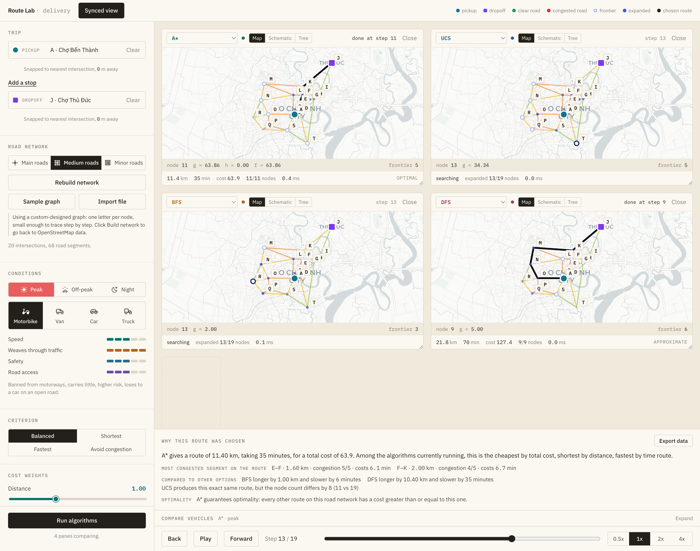

# Route Lab

An interactive comparison of classical search algorithms, applied to delivery routing on the real
street network of Ho Chi Minh City.

Pick a pickup point, a dropoff point, and any number of intermediate stops. The app downloads the
actual roads around your route from OpenStreetMap, builds a weighted graph out of them, and runs up
to six search algorithms side by side on a shared timeline — so you watch BFS flood outward in
every direction while A\* drives a narrow wedge straight at the goal, at the same step number, on the
same map.

The point is not the route. UCS and A\* return the *same* route, always, because both are optimal
over the same cost function. What differs — and what the interface is built to show — is how much
work each algorithm did to get there.



*The real application, paused at step 13 of 19 on the built-in sample graph.*

Reading the picture: the sidebar on the left is the only place a run is defined, so every pane
provably ran on the same input. Each pane owns one algorithm and can show it as a map, a
stripped-back schematic, or the search tree itself. The timeline at the bottom drives all of them at
once — which is what makes the comparison honest.

Look at what that single frozen step reveals. A\* has already finished, at step 11, with an 11.4 km
route it can guarantee is optimal. UCS is still searching at step 13 and will need 19 — and when it
arrives it will produce **the identical route**, because both minimise the same cost. BFS is also
still going and will return a route 1 km longer, because it counts hops rather than cost. DFS
finished first, at step 9, with a 21.8 km route — nearly twice as long — and the footer marks it
approximate rather than optimal.

That is the whole argument of the tool in one screen: the route is rarely the interesting part,
the amount of work spent finding it is.

---

## Requirements

| | |
|---|---|
| **Bun** | 1.0 or newer. This project does **not** use npm or yarn — see [Package manager](#package-manager) below. |
| **A modern browser** | Chrome, Edge, Firefox, or Safari. |
| **An internet connection** | Road data, geocoding, map tiles, and fonts are all fetched live. Nothing is bundled offline. |
| **uv** | Only for the Python backend in `server/`. The frontend runs standalone without it — see [Backend](#backend). |

Install Bun if you do not have it:

```bash
curl -fsSL https://bun.sh/install | bash      # macOS / Linux
# or: brew install oven-sh/bun/bun
```

Check it works:

```bash
bun --version
```

---

## Install and run

```bash
cd web
bun install
bun run dev
```

`bun run dev` starts the Vite dev server and **opens your browser automatically** (configured in
`vite.config.ts`). If it does not, open the URL Vite prints, normally <http://localhost:5173>.

That runs the frontend alone, on its built-in TypeScript planner. To bring the Python backend up
alongside it, run `make dev` from the repository root instead — see [Backend](#backend) below.

### All commands

Run these from the `web/` directory.

| Command | What it does |
|---|---|
| `bun install` | Install dependencies. Reads `bun.lock`. |
| `bun run dev` | Dev server with hot reload. Your normal workflow. |
| `bun run build` | Typecheck (`tsc -b`) then produce a production bundle in `web/dist/`. |
| `bun run preview` | Serve the built `dist/` locally, to check the production build. |
| `bunx tsc --noEmit` | Typecheck only, without building. Fast. |

`web/` has **no test suite**. Verification there is `bunx tsc --noEmit` plus running the app. The
backend does have one — `cd server && make check` runs lint, both type checkers, import layering,
and `pytest`.

### First run, step by step

1. In the sidebar, type a pickup point — try `Chợ Bến Thành`. Pick a result from the dropdown.
2. Type a dropoff point — try `Landmark 81`.
3. Press **Build network** (it reads *Rebuild network* once a network is loaded). The app queries
   Overpass for every road in a corridor between your two
   points. This takes a few seconds and is the slowest step; there is a hard 75-second cutoff.
4. Press **Add the first pane**, then **Add pane** for each one after that, up to six. Each pane
   picks the next unused algorithm.
5. Press **Run algorithms**. Watch the timeline at the bottom drive every pane at once.

**No internet, or Overpass is down?** Press **Sample graph** instead of *Build network*. That uses
a hand-built 21-node graph of real HCMC landmarks that needs no network access at all — see
[Sample graph](#sample-graph).

---

## What you can change

Everything below lives in the sidebar and is the single source of truth for a run. Changing any of
it clears every pane's result, so you never see half-old, half-new numbers.

**Trip** — pickup, dropoff, and any number of intermediate stops. With stops, the app can also
optimise the visit order using a nearest-neighbour heuristic measured in real cost, not straight-line
distance.

**Road network** — the detail level controls which road classes get downloaded:

| Level | Road classes fetched |
|---|---|
| Main roads | motorway, trunk, primary |
| Medium roads | + secondary |
| Minor roads | + tertiary, residential |
| With alleys | + alleys |

Higher detail means a better network and a much slower, much larger download. The app enforces a
corridor-area cap per level and will automatically fall back to a different level if the network
comes back too fragmented to route through, telling you when it does.

**Conditions** — vehicle and time period:

| Vehicle | Character |
|---|---|
| Motorbike | The only vehicle allowed in alleys, weaves through congestion, exempt from most turn restrictions. Banned from motorways. |
| Van | Can use every street, not subject to the truck curfew. Never the fastest at anything. |
| Car | Fastest on an open road, safest. Badly hurt by congestion, no alleys. |
| Truck | Carries the most. Banned from residential roads and alleys, and subject to a peak-hour curfew on inner-city branch and major roads. |

Time period is peak, off-peak, or night. Importantly, the period acts on **congestion**, not on base
speed — so at night, when congestion nearly vanishes, a car beats a motorbike, exactly as in real
life. Multiplying base speed instead would make the motorbike's advantage a fixed ratio at every
hour of the day, which is not true. See the long comment in `lib/traffic.ts` for the measurements
behind this.

**Criterion and weights** — four sliders (distance, time, congestion, risk) feed the cost function.
Presets are Balanced, Shortest, Fastest, and Avoid-congestion; touching any slider switches you to
Custom. Set all four to zero and every route costs the same — the app detects this and withdraws its
"optimal" claim rather than stamping a meaningless guarantee on the result.

---

## The six algorithms

The first four are point-to-point searches, run once per leg. The last two are trip-level: they
choose the *visit order* over the stops and leave the per-leg routing to a point search.

| Algorithm | Priority | Optimal? | Character |
|---|---|---|---|
| **BFS** | insertion order | no | Fewest hops, ignores cost entirely |
| **DFS** | stack order | no | Plunges down one branch, usually a bad route |
| **UCS** | `g(n)` | **yes** | Expands evenly in every direction |
| **A\*** | `g(n) + h(n)` | **yes** | Same route as UCS, far fewer nodes expanded |
| **Nearest Neighbor** | cheapest unvisited stop | no | Orders stops greedily by real route cost; each leg is UCS |
| **Held–Karp DP** | bitmask dynamic programming | **yes** | The exact cheapest visit order, from Pairwise A\* costs. Backend only |

Held–Karp is exponential in the number of stops, which is why it is exact and why it is not the
default. It is also the one algorithm the in-browser planner refuses outright — a pane set to it
without a backend configured says so rather than quietly returning a heuristic answer.

**Why there is no Dijkstra entry.** On a graph with non-negative edge weights, Dijkstra and UCS are
the same algorithm — the same priority function `g(n)`, the same expansion order, the same route.
Listing both would put two identical panes side by side in a tool whose entire purpose is showing
how algorithms *differ*. UCS is the name used here, and its pane footer says so explicitly.

**The heuristic.** `h(n)` is the straight-line (great-circle) distance to the goal, multiplied by the
cheapest cost-per-km found anywhere in the network. Using raw kilometres instead would make the
heuristic far too weak and A\* would degenerate into UCS, destroying the comparison. Scaling by the
network minimum keeps it admissible — it can never overestimate — while staying tight enough to be
worth something.

---

## The cost model

```
cost(edge) = w_distance   · km
           + w_time       · minutes
           + w_congestion · congestion · km
           + w_risk       · risk · vehicleRiskFactor · km
```

Congestion and risk are multiplied by edge length deliberately. Without that, a route crossing many
short blocks is penalised for its *number of intersections* rather than for how bad its traffic
actually is, and the search starts preferring long empty detours.

`minutes` comes from an open-road speed per road class, divided by a jam factor built from the edge's
congestion level, the vehicle's sensitivity to congestion, and the time period.

---

## Real-world constraints modelled

- **One-way streets** — respected as directed edges.
- **Vehicle bans by road class** — trucks out of alleys, motorbikes off motorways, and so on.
- **Truck curfew** — a time-based ban, not a permanent one, so changing the time period can unblock
  a route that was blocked a moment ago.
- **Turn restrictions** — parsed from OpenStreetMap turn-restriction relations, including the
  time-conditional ones and the `except` list that exempts motorbikes. This matters more than it
  sounds: measured across 757 turn restrictions in central HCMC, 491 are time-conditional and 459
  exempt motorbikes.
- **Connectivity repair** — the downloaded network is reduced to its largest strongly connected
  component, so the search never starts inside a fragment it cannot escape.

When a leg has no route, the app does not just say "unreachable". It runs two extra traversals to
distinguish *why* — a genuinely disconnected network, a one-way trap, a vehicle ban, or a curfew —
because those four need four different fixes.

---

## Sample graph

`lib/sampleGraph.ts` holds a hand-built graph: **21 nodes, 36 edges**, each node a real HCMC landmark
labelled `A` through `U`, so a route can be described as `A → D → E → F → K → J` and traced by eye.
The numbers were chosen so the algorithms visibly disagree — a short route through the heavy
congestion at Hàng Xanh, a longer free-flowing route past Landmark 81, and dead-end branches to the
west for DFS to fall into.

It needs no network access, so it is also the fallback when Overpass is unavailable.

### Importing your own graph

The sidebar accepts a JSON file. Both Vietnamese and English key names are accepted:

```jsonc
{
  "nodes": [                              // or "nut"
    { "id": "A", "lat": 10.7725, "lng": 106.6980, "label": "A", "name": "Chợ Bến Thành" }
  ],
  "edges": [                              // or "doanDuong"
    {
      "from": "A", "to": "C",             // or "tu" / "den"
      "km": 0.7,
      "roadClass": "secondary",           // or "capDuong"
      "congestion": 4,                    // or "mucKetXe", clamped to 1–5
      "risk": 0.1,                        // or "ruiRo",    clamped to 0–1
      "name": "A–C"                       // or "ten"
    }
  ]
}
```

Congestion and risk are range-clamped on import. This is not fussiness: a negative congestion value
produces a negative edge cost, and negative edge costs silently break the optimality guarantee that
UCS and A\* rely on — the app would keep stamping "optimal" on a route that is not.

---

## Project structure

```
.
├── README.md
├── CONVENTIONS.md              naming and coding rules — read before contributing
├── Lab 1 - Searching.pdf       the assignment brief
├── docs/
│   ├── design-spec.md          UI/UX design spec, with the reasoning behind each decision
│   ├── ui-screenshot.png       the screenshot at the top of this file
│   └── ui-overview.svg         annotated schematic of the same layout
├── web/                        the real application
│   ├── index.html
│   ├── package.json
│   ├── bun.lock
│   ├── vite.config.ts
│   ├── tsconfig.json
│   └── src/
│       ├── main.tsx            entry point
│       ├── App.tsx             shell: topbar, sidebar, pane grid, timeline
│       ├── store.ts            the single Zustand store — all query state lives here
│       ├── styles.css          the whole design system
│       ├── components/
│       │   ├── Sidebar.tsx          every input that defines a run
│       │   ├── MapPane.tsx          one algorithm's pane: map, schematic, and tree views
│       │   ├── TreeView.tsx         radial search-tree layout
│       │   ├── Timeline.tsx         the shared step control
│       │   ├── Compare.tsx          side-by-side vehicle comparison
│       │   ├── CompareAlgos.tsx     side-by-side algorithm comparison, best value marked
│       │   ├── CompareCriteria.tsx  side-by-side weight-preset comparison
│       │   ├── HeldKarpNotice.tsx   why a Held–Karp pane cannot run right now
│       │   ├── Explain.tsx          the generated explanation of the chosen route
│       │   ├── PlaceField.tsx       debounced geocoding search box
│       │   └── Segment.tsx          segmented-control primitive
│       ├── lib/                     pure logic — no React, no DOM
│       │   ├── search.ts            BFS, DFS, UCS, A*, the heap, multi-leg planning
│       │   ├── planClient.ts        the backend integration: POST /plan when VITE_API_URL is set
│       │   ├── traffic.ts           vehicles, periods, road classes, the cost model
│       │   ├── overpass.ts          OpenStreetMap fetching and graph construction
│       │   ├── geocode.ts           address lookup
│       │   ├── recentPlaces.ts      the last places picked, kept between sessions
│       │   ├── explain.ts           turns a run's numbers into sentences
│       │   ├── tripNames.ts         names a trip's points for the UI and the explanation
│       │   ├── tree.ts              search-tree layout
│       │   ├── viewSync.ts          the shared map viewport across panes
│       │   ├── sampleGraph.ts       the offline sample network
│       │   ├── sampleCases.ts       the scenarios that network exists to demonstrate
│       │   ├── geo.ts               haversine and bounds maths
│       │   └── types.ts             shared types
│       └── icons/
└── server/                     the Python planning backend — see Backend below
    ├── README.md               the algorithms team's playground guide
    ├── pyproject.toml
    ├── uv.lock
    ├── Makefile
    ├── tests/                  pytest suite — the backend's verification, run by `make check`
    └── src/route_lab/
        ├── contract/           Pydantic mirror of web/src/lib/types.ts
        ├── shared/             cost model, haversine, heap, search harness — ported from lib/
        ├── algorithms/         one file per algorithm; ucs.py is the worked reference
        ├── planner.py          builds legs, dispatches algorithms, aggregates a RouteResult
        ├── diagnostics.py      explains why a leg found no route
        └── api.py              FastAPI app: POST /plan, GET /health
```

`lib/` must stay importable without React. If something there needs a hook, it belongs in a component
or in the store.

---

## Architecture

**One store, no local copies.** Every value that defines a run lives in `store.ts`. No component owns
its own copy of the pickup point or the weights. Changing any input clears all results at once.

**Panes are views, not owners.** A pane holds an algorithm choice, a view mode, and a result. It does
not hold query state. This is what makes the comparison honest — every pane provably ran on the same
input.

**One timeline drives everything.** Step 128 means step 128 in every pane simultaneously. Per-pane
playback speed was deliberately *not* implemented: it would destroy comparability, which is the whole
point of the tool.

**Traces store node indices, not id strings.** A single run over a few-hundred-node network produces
tens of thousands of frontier entries; times six panes, storing strings would waste a lot of memory
for nothing. `RouteResult.nodeIds` maps back.

---

## Backend

`server/` is a Python/FastAPI service, managed with `uv`, and it is the real planning backend.
`web/src/lib/search.ts` was a demo — BFS, DFS, UCS, and A\* running in the browser, no server
involved — that proved the idea and shipped the first version of the app. The Python service speaks
the identical JSON contract (`POST /plan` in, a `RouteResult` out) so it replaces that in-browser
search without the frontend's request or response shapes changing. See
[`server/README.md`](server/README.md) for the full playground guide, including how to implement an
algorithm.

**`VITE_API_URL` is the switch.** Set it and the Run button sends every pane to the backend —
including the sample graph, and including Held–Karp, which has no in-browser implementation; leave
it unset and the built-in TypeScript planner runs instead. See
[`web/.env.example`](web/.env.example).

Running both halves against each other, from the repository root:

```bash
make dev     # backend on http://127.0.0.1:8787, frontend on http://localhost:5173
```

One Ctrl-C stops both. `make` on its own lists the other whole-project targets
(`install`, `check`, `test`, `lint`, `format`, `build`, `clean`).

To run them separately instead, in two terminals:

```bash
cd server && make dev                                      # backend, http://127.0.0.1:8787
cd web && VITE_API_URL=http://127.0.0.1:8787 bun run dev   # frontend, points at it
```

---

## External services

| Service | Used for | Notes |
|---|---|---|
| [Overpass API](https://overpass-api.de/) | Road geometry and turn restrictions | Public and rate-limited. Retried with backoff on 429/503/504, hard 75-second cutoff. |
| [Nominatim](https://nominatim.openstreetmap.org/) | Geocoding the search box | Public, roughly 1 request/second. |
| CARTO Positron | Map tiles | Light grey basemap, chosen so every saturated colour on screen is one the app drew. |
| Google Fonts | IBM Plex Sans and Mono | Both have complete Vietnamese coverage with correctly placed tone marks. |

No API keys are needed. No data leaves your machine beyond these queries.

---

## Language

The interface, the code, the comments, and the documentation are in **English**. Vietnamese place
names in the *data* — `Chợ Bến Thành`, `Hàng Xanh`, street names returned by OpenStreetMap — stay
in Vietnamese, because they are real geographic names and translating them would make them wrong.

A label reading `Pickup` next to a value reading `Chợ Bến Thành` is the intended result.

---

## Package manager

**This project uses Bun.** Do not run `npm install` or `yarn`. The lockfile is `bun.lock`;
`package-lock.json` has been removed and should not come back. Two lockfiles in one project is how
you end up with two different dependency trees and a bug that only reproduces on one machine.

---

## Documentation

| File | What it is |
|---|---|
| [`CONVENTIONS.md`](CONVENTIONS.md) | Naming, comment style, TypeScript and React rules, the domain glossary, and the commit/branch conventions. Binding. |
| [`docs/design-spec.md`](docs/design-spec.md) | The design specification. Argues for each interface decision, cites the measurements behind the constants, and records what was tried and rejected. Read this before changing the interface. |
| [`docs/ui-screenshot.png`](docs/ui-screenshot.png) | The screenshot at the top of this file. Captured from the running app; regenerate it if the interface changes. |
| [`docs/ui-overview.svg`](docs/ui-overview.svg) | An annotated schematic of the same layout, with the four regions labelled. Useful where a screenshot's density gets in the way. |
| [`server/README.md`](server/README.md) | The backend's playground guide: install and run, the layered package architecture, and how to implement an algorithm. |
| `Lab 1 - Searching.pdf` | The assignment brief. |
| `.github/workflows/ci.yml` | Runs the frontend typecheck and build, and the backend lint/typecheck/import-layering/test gate, on every push and pull request. |

## Contributing

Read [`CONVENTIONS.md`](CONVENTIONS.md) first. It is short and binding, and covers naming, comment
style, TypeScript rules, React and state rules, and the domain glossary that keeps the UI and the
code speaking the same language.

Two rules worth repeating here:

- **Comment the decision, not the mechanics.** The code already says what it does. A comment earns
  its place by recording why this approach beat the obvious one, or what breaks if someone
  "simplifies" it.
- **Both `bunx tsc --noEmit` and `bun run build` must pass before a commit**, and `make check` too
  if you touched `server/`. CI runs all of it.

---

## Status and known limitations

**Known limitations:**

- **The JSON export in `lib/explain.ts` uses Vietnamese object keys** (`dieuKien`, `mangLuoi`, …),
  which contradicts the language policy above. Left alone deliberately, because changing it changes
  the submission file format.
- **Nearest-neighbour stop ordering is a heuristic**, so a trip ordered that way is not claimed to
  be optimal even when each leg is. Held–Karp does solve the visit order exactly — it is the
  travelling-salesman problem, and `server/src/route_lab/algorithms/held_karp.py` solves it by
  bitmask dynamic programming — but it is exponential in the number of stops, so it is capped, and
  it exists only in the Python backend.
- **`web/` has no automated tests.** Verification there is `bunx tsc --noEmit`, `bun run build`, and
  running the app. `server/` is covered by `pytest`; `cd server && make check` is its gate, and CI
  runs both.

**Recently fixed, worth knowing about if you read older notes:**

- Turn restrictions could produce a false "no route found". The search state is now
  `(intersection, arriving segment)` on networks that carry restrictions, so a costlier arrival that
  is legally turnable is tried instead of being shut out by the cheapest one.
- Displayed totals could disagree with the search's own cost where two roads join the same pair of
  intersections. Statistics are now summed over the edge objects the search actually traversed.
- Importing a graph left the trip pinned to the *previous* graph's node ids, which crashed the
  guided searches and made the others silently report "unreachable".
